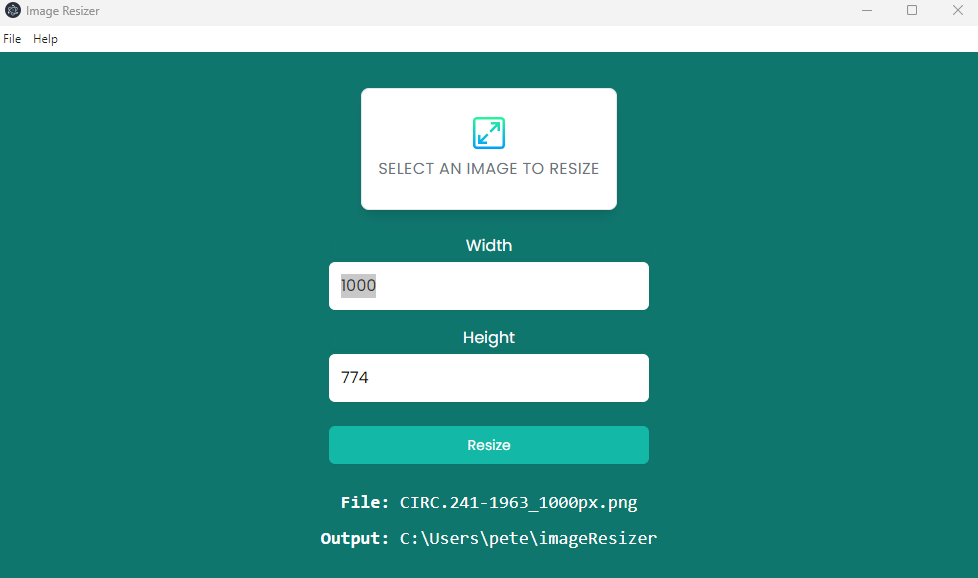

This app is built using electron and node.js.
It will re-size an image and save it for you. 

To get this code running you'll need to do the following in your VS code terminal:
npm init
The following line then brings in the necessary node.js libraries: 
npm i electron resize-img toastify-js

Then to run the code you'll need to do the following: 
npm start to get it going
OR "npx electronmon ." typed into the terminal automatically re-starts the open window if you make a change in the code.    
ctrl + C to end the console programme
ctrl + shit + i opens up the dev tools in the open window

tutorial link:
https: www.youtube.com/watch?v=ML743nrkMHw&ab_channel=TraversyMedia
link to the repo: 
[https: github.com/bradtraversy/image-resizer-electron](https://github.com/bradtraversy/image-resizer-electron)